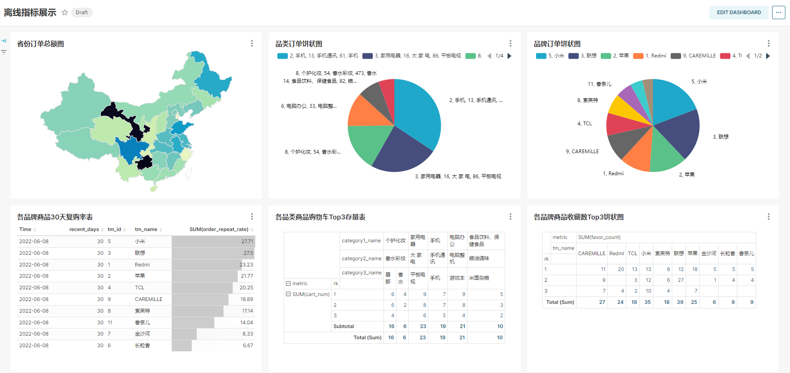

# Offline-E-commerce-Data-Warehouse
本项目是基于B站[尚硅谷离线数仓6.0](https://www.bilibili.com/video/BV1UN411j79o/)进行学习后的总结和整理：

## 1. 项目可视化呈现

## 2. 组件和集群部署
**服务器集群基本信息**
|     | master         | slave1         | slave2         |
|-----|----------------|----------------|----------------|
| CPU | 2C/4T          | 2C/4T          | 2C/4T          |
| 内存  | 6GB/5200MHz    | 4GB/5200MHz    | 4GB/5200MHz    |
| 硬盘  | SSD 50GB       | SSD 50GB       | SSD 50GB       |
| IP  | 192.168.10.102 | 192.168.10.103 | 192.168.10.104 |
| 系统  | CentOS7.0      | CentOS7.0      | CentOS7.0      |

**组件规划**
| 组件名称             | 版本号     | 子服务               | master | slave1 | slave2 | 说明                                          |
|------------------|---------|-------------------|--------|--------|--------|---------------------------------------------|
| java             | 1.8.212 | java              | √      | √      | √      |                                             |
| MySQL            | 8.0.31  | MySQL             | √      | √      | √      |                                             |
| HDFS             |         |  DataNode         | √      | √      | √      |                                             |
|                  |         | SecondaryNameNode |        |        | √      |                                             |
|                  |         | NameNode          | √      |        |        |                                             |
| Yarn             |         | ResourceManager   |        | √      |        |                                             |
|                  |         | NodeManager       | √      | √      | √      |                                             |
| Spark            | 3.3.1   | Spark on Yarn     | √      | √      | √      |                                             |
| Zookeeper        | 3.7.1   | Zookeeper         | √      | √      | √      |                                             |
| hive             | 3.1.3   | Hive on Spark     | √      |        |        | 需要编译源码，解决与 hadoop-3.3.1 和 Spark-3.3.1 的兼容问题 |
| Kafka            | 3.3.1   | Kafka             | √      | √      | √      |                                             |
| Flume            | 1.10.1  | Flume             | √      | √      | √      | master 消费 Kafka，slave 采集日志                  |
| Maxwell          | 1.29.2  | Maxwell           | √      | √      | √      | 同步 MySQL                                    |
| DataX            |         | DataX             | √      | √      | √      |                                             |
| Superset         |         | Superset          | √      |        |        | 可视化                                         |
| DolphinScheduler |         | MasterServer      | √      | √      |        |                                             |
|                  |         | WorkerServer      |        | √      | √      |                                             |
